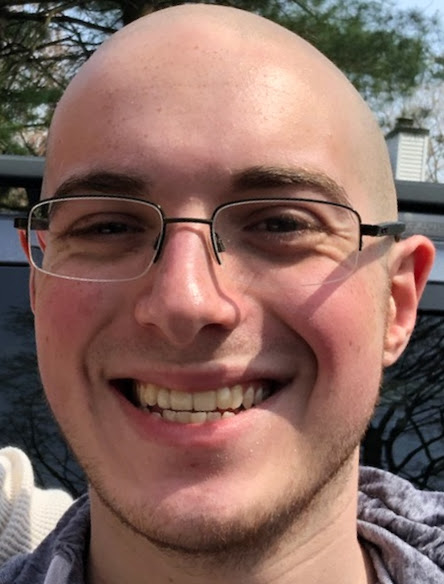

# Open Source Software - Summer 2019
## Name: Benjamin Sherman
### email: benjamin@bensherman.io
### github account: benjaminrsherman
### mattermost handle: phi11ipus

## Bio
I am a Computer Science student at [RPI](https://rpi.edu/).  I'm currently working on [Soul Engine](https://github.com/Synodic-Software/Soul-Engine/) for [RCOS](https://rcos.io/).

## Lab Reports
[Lab 1](labs/lab-01/report.md)
[Lab 2](labs/lab-02/report.md)
[Lab 3](labs/lab-03/report.md)
[Lab 4](labs/lab-04/report.md)
[Lab 5](labs/lab-05/report.md)
[Lab 6](labs/lab-06/report.md)
[Lab 7](labs/lab-07/report.md)
[Lab 8](labs/lab-08/report.md)
[Lab 9](labs/lab-09/report.md)
