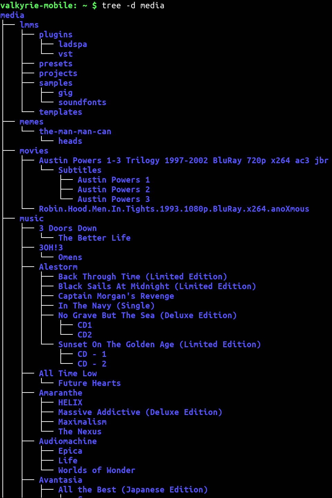
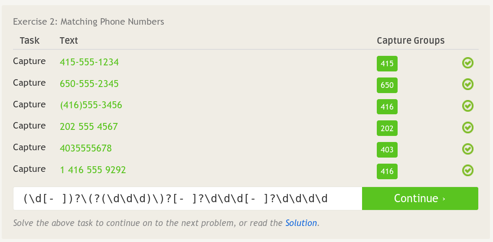

# Reading Assignments
## How to Answer Questions in Helpful Way
- Explain why the answer is correct
- If relevant, predict future problems and give warnings about them too

## Free Culture, Chapter 3: Catalogs
	One takeaway I got from this reading is that when working on open source software, you are responsible for what your software is used for.  Jesse Jordan, should not have been sued, in my opinion, however he was partially to blame for the piracy at Rensselaer.  By modifying the search engine to be easier to use, Jesse also made it easier to pirate.  This isn't to say that Jesse did a bad thing by fixing the bug in the search engine -- on the contrary, I think that that was a good thing.  Perhaps he could have tried to stop people from using his engine to index illicit data, but he then risks censorship.  Ultimately, the biggest takeaway from this reading for me is to always use a license which removes liability from yourself when making a piece of software.  Obviously one should do their best to ensure that their code will not be used for nefarious purposes, but if it is used by wrongdoers, it's best if the creator is not held accountable for it.

# Linux
## `tree` output

Note: Since each of these directories contain many files, I only listed directories.

# Regex
## RegexOne Problems

## Regex Crossword Puzzles

# Play with Blockly

# Reflection
	At RPI, one of the biggest problems I've come up against is the difficulty in planning courses multiple semesters in advance.  I've had to deal with this a lot since I'm trying to graduate in three years, so it's important that I am able to meet all graduation requirements.  The issue is that there is no easy way to view all the requirements for a course (i.e. when a course is offered, which courses are prerequisites, and these same constraints on those courses).  Inspired by [YACS](http://yacs.io/), I want to make a website which can be used to plan course schedules over multiple semesters.  Ideally, it would show which courses are prerequites and automatically add those to your schedule, as well as restricting courses to when they are offered.  This project could potentially also track progress towards graduation, however I would have to look into how complex such a system would have to be.
