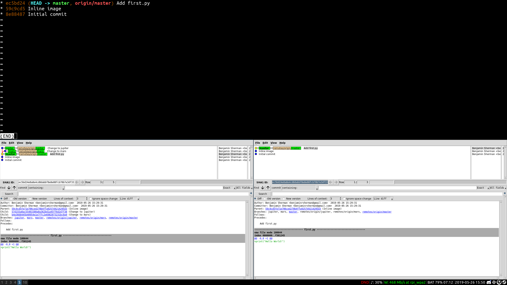
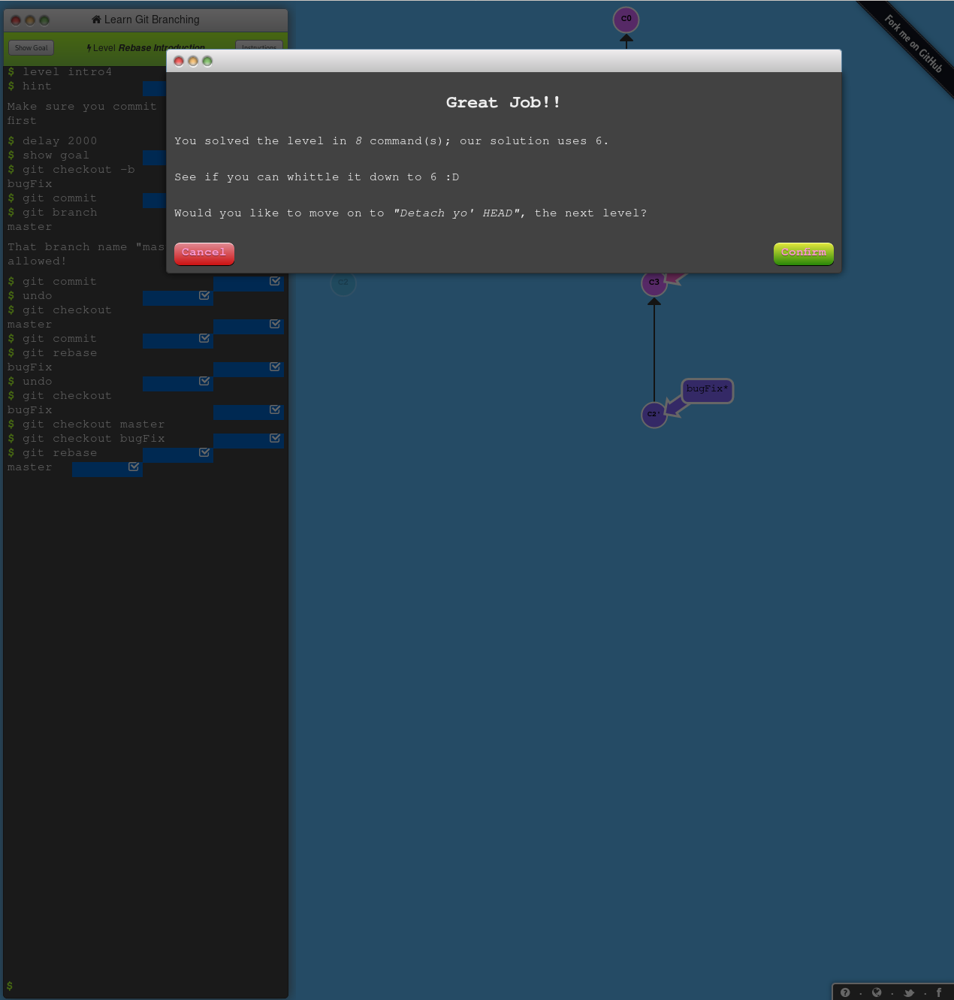
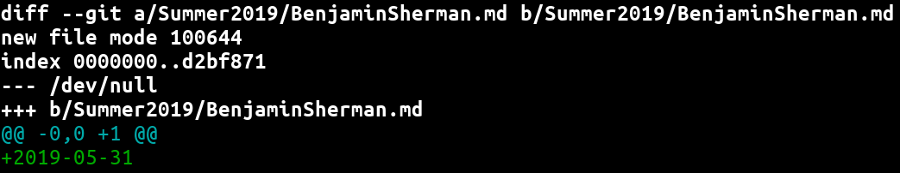
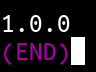

# Lab2

## Part 1
Here are the results from my git branches:

## Part 2
My forked repo: [https://github.com/benjaminrsherman/Spoon-Knife](https://github.com/benjaminrsherman/Spoon-Knife)
I also did the first four levels of [Learn Git Branching](http://pcottle.github.io/learnGitBranching/):

## Part 3
My forked repo: [https://github.com/benjaminrsherman/PullReq](https://github.com/benjaminrsherman/PullReq)
The diff from my pull request (a screenshot from `git diff` is show below) shows that I added one line to the new file `BenjaminSherman.md` with the contents `2019-05-31`.

`git tag -l output`:

