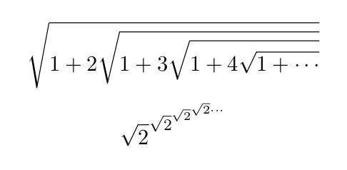
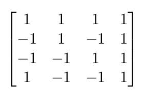

# Lab 3

## Documentation
> Note: I've changed my idea about what I want to work on, so this is a new project idea.

1. I want to work on a project to track degree progress and develop a plan to take certain courses.  This would automatically generate a tree for required prerequisites as well.  This idea is similar to YACS, however instead of fitting a certain group of courses into one semester, this would be planning courses over multiple semesters.  As for technology, I want to try creating this project in Rust, as it looks like a promising language which I would like to learn and also has a WebAssembly build target.  The final goal for this project is to have a web interface for the tool, however I am going to first focus on creating a CLI version as that will be simpler.

2. The below LaTeX was generated by this formula:
```
$$\sqrt{1 + 2\sqrt{1 + 3\sqrt{1 + 4\sqrt{1 + \cdots}}}}$$
$$\sqrt{2}^{\sqrt{2}^{\sqrt{2}^{\sqrt{2}\cdots}}}$$
```


3. The below LaTeX was generated by this formula:
```
$$\begin{bmatrix}
1 & 1 & 1 & 1\\
-1 & 1 & -1 & 1\\
-1 & -1 & 1 & 1\\
1 & -1 & -1 & 1
\end{bmatrix}$$
```


## Community
1. Number of contributors: 2
2. Number of lines of code: 14,225
3. First commit: 2019-3-12 (37c204611bb1029aad391aa4ada00649cffb1884)
4. Latest commit: 2019-4-26 (6bf2d7349e1f6d57f487b5d54192b584539d7592)
5. Current branches:
	- master
	- Demo
