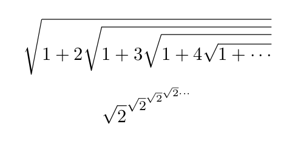
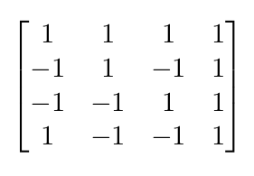

# Lab 3

## Documentation
> Note: I've changed my idea about what I want to work on, so this is a new project idea.

1. I want to work on a project to track degree progress and develop a plan to take certain courses.  This would automatically generate a tree for required prerequisites as well.  This idea is similar to YACS, however instead of fitting a certain group of courses into one semester, this would be planning courses over multiple semesters.  As for technology, I want to try creating this project in Rust, as it looks like a promising language which I would like to learn and also has a WebAssembly build target.  The final goal for this project is to have a web interface for the tool, however I am going to first focus on creating a CLI version as that will be simpler.

2. The below LaTeX was generated by this formula:
```
$$\sqrt{1 + 2\sqrt{1 + 3\sqrt{1 + 4\sqrt{1 + \cdots}}}}$$
$$\sqrt{2}^{\sqrt{2}^{\sqrt{2}^{\sqrt{2}\cdots}}}$$
```


3. The below LaTeX was generated by this formula:
```
$$\begin{bmatrix}
1 & 1 & 1 & 1\\
-1 & 1 & -1 & 1\\
-1 & -1 & 1 & 1\\
1 & -1 & -1 & 1
\end{bmatrix}$$
```


## Community

### BeirRun
Github Results:
- Number of contributors: 2
- Number of lines of code: 14,225
- First commit: 2019-3-12 (37c204611bb1029aad391aa4ada00649cffb1884)
- Latest commit: 2019-4-26 (6bf2d7349e1f6d57f487b5d54192b584539d7592)
- Current branches:
	- master
	- Demo

GitStats Results:
- Number of authors: 4
- Number of lines of code: 11,314
- Commit information not provided
- Branch information not provided

### Catan-AI
- 3 contributors
- 4058 lines of code
- first commit: 97f641bc3e670d9823ae7e11d842f12af6171707
- latest commit: e4963f4d0810a57f761ea4e0245bc4e52977a333
- 4 active branches: master, Simple_Bot, CatanResearch, Empty_Bot
- 2 stale branches: add-license-1, Ports

Gitstats says:
- 5 authors
- 2937 lines of code (4065 added, 1128 removed)
- first commit: 2019-01-14 (no key provided)
- latest commit: 2019-03-16 (no key provided)
- no branches provided

### Code Buddy
- 2 contributors
- 1336 lines of code
- first commit: 2019-03-19
- latest commit: 2019-04-25
- current branches: master add-code-of-conduct1

When I ran gitstats on CodeBuddy the total lines of code different from the number I had earlier. Gitstats says the project has 1288 lines or code. Also, gitstats provides a lot more detail on how the files changed and how many commits each author made through graphs.

### ckRGB
- Contributors: 3

- Lines of code: 68789

- First Commit: Mar 10, 2019

- Final Commit: Jun 7, 2019

- Current Branches: master, c_api, hardware

The lines of code differ a lot from the html and terminal output. From the terminal, I have 68789. From the gitstats output, I have 41272. The reason why there is a difference is probably because the command ran in the terminal takes in account of every document in the repository, which includes documentations and README.md. The gitstats only looks for lines of code that are actually working, which excludes the documentations. 
