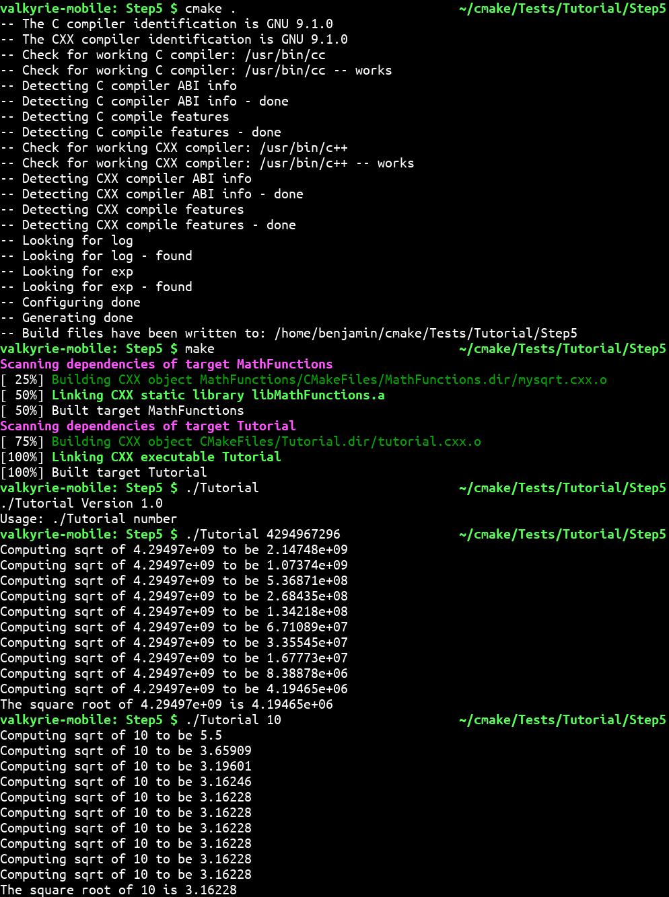

# Lab 5: Build Systems

## CMake

### Step1
My work is accessible in [the Step1 directory](cmake/Step1)

### Step2
My work is accessible in [the Step2 directory](cmake/Step2)

### Step3
My work is accessible in [the Step3 directory](cmake/Step3)

### Step4
My work is accessible in [the Step4 directory](cmake/Step4)
My ctest output is available in [cmake/Step4/ctest_output.txt](cmake/Step4/ctest_output.txt_)

### Step5
My work is accessible in [the Step5 directory](cmake/Step5)

## Makefile vs CMake Comparison

The Makefile is located at [makefile-vs-cmake-comparison/Makefile](makefile-vs-cmake-comparison/Makefile)
The CMakeLists.txt file is located at [makefile-vs-cmake-comparison/CMakeLists.txt](makefile-vs-cmake-comparison/CMakeLists.txt)
The CMake Makefile is located at [makefile-vs-cmake-comparison/build/Makefile](makefile-vs-cmake-comparison/build/Makefile)

The `dynamic_block` executable is 16536 bytes and the `static_block` executable 16712.
