# Lab 8

## Data Visualization with ggplot2 (images/Part 1)
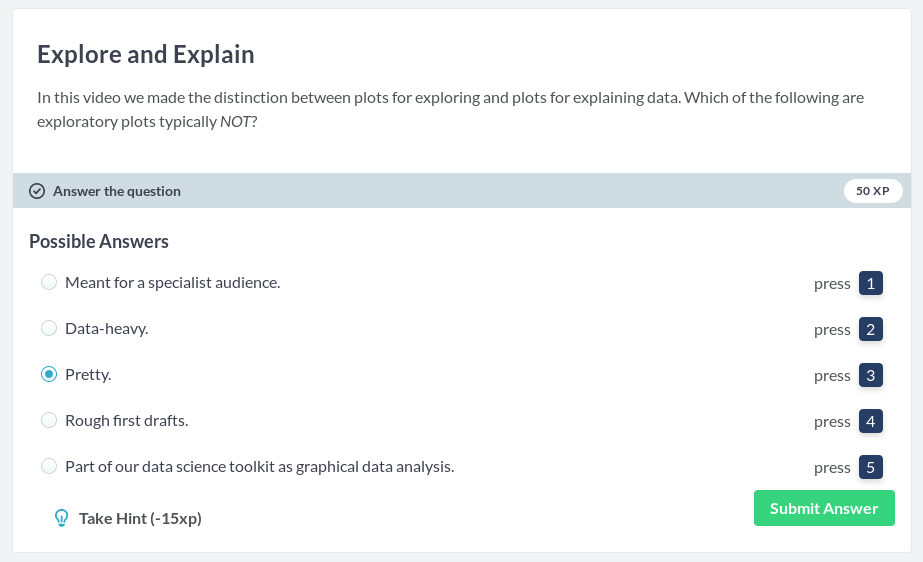
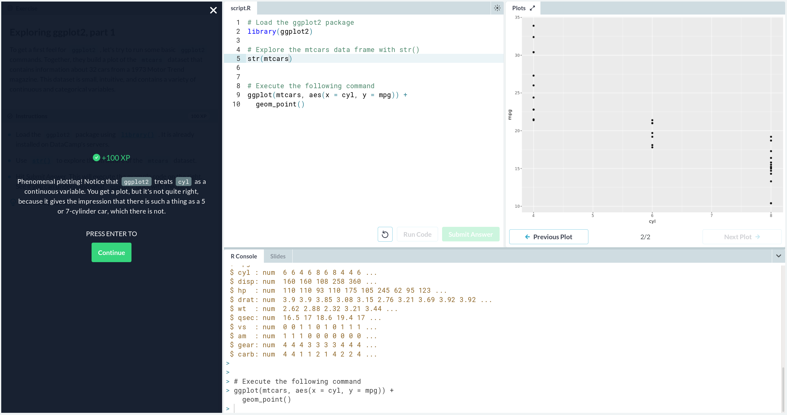

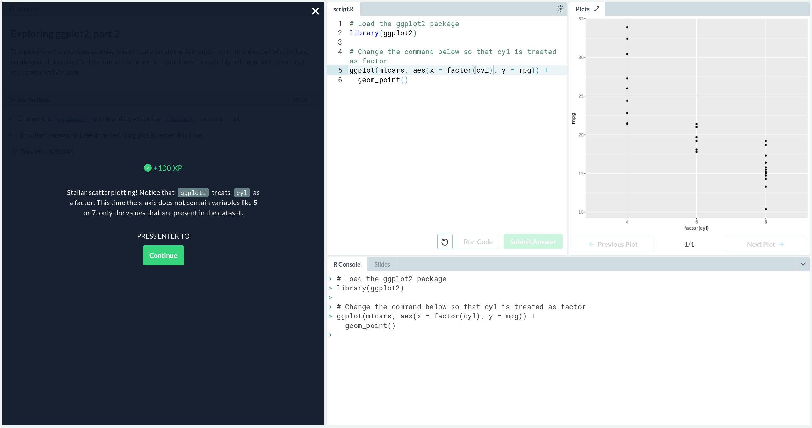
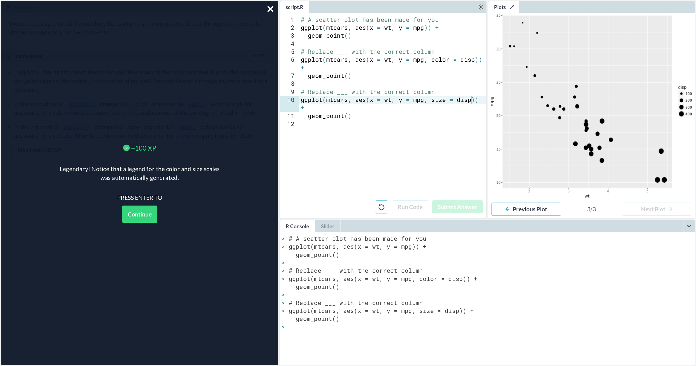
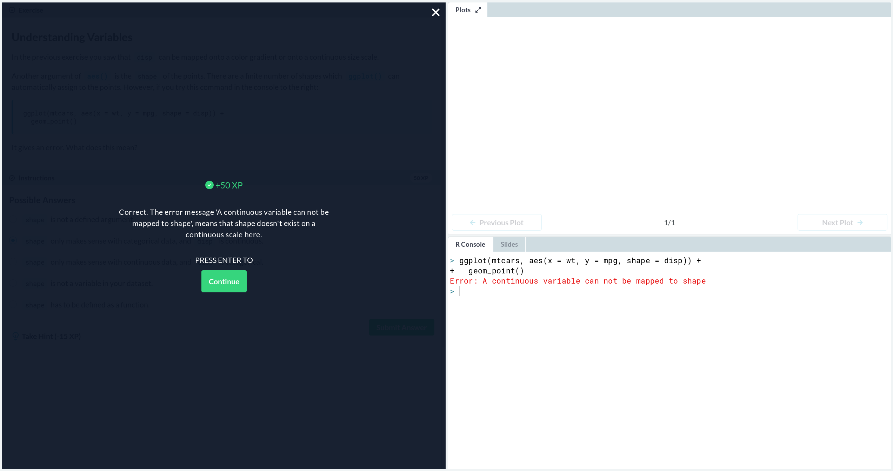
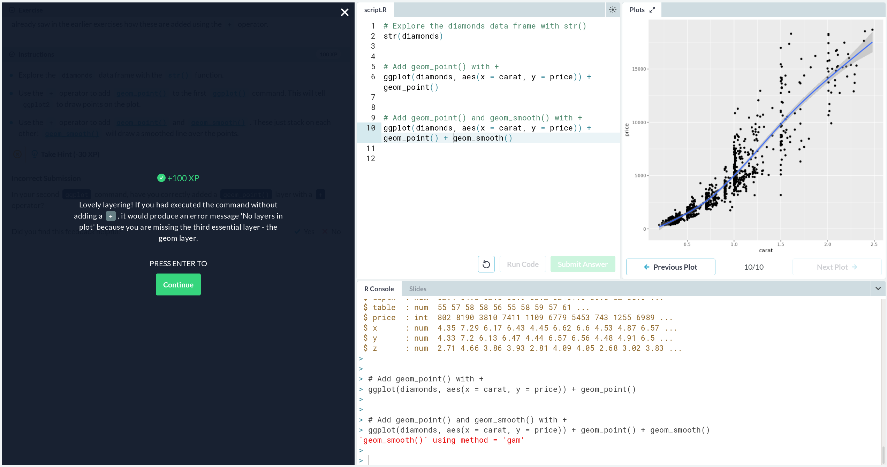
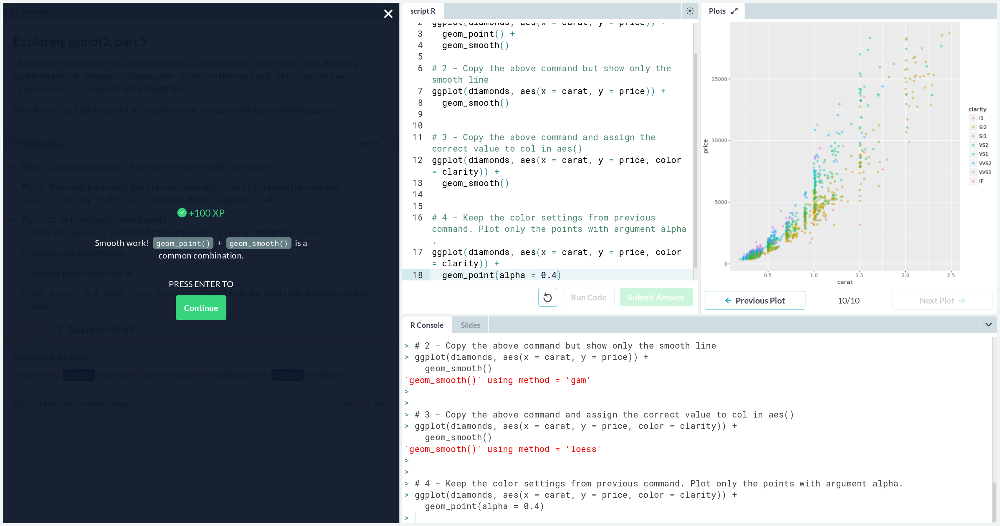
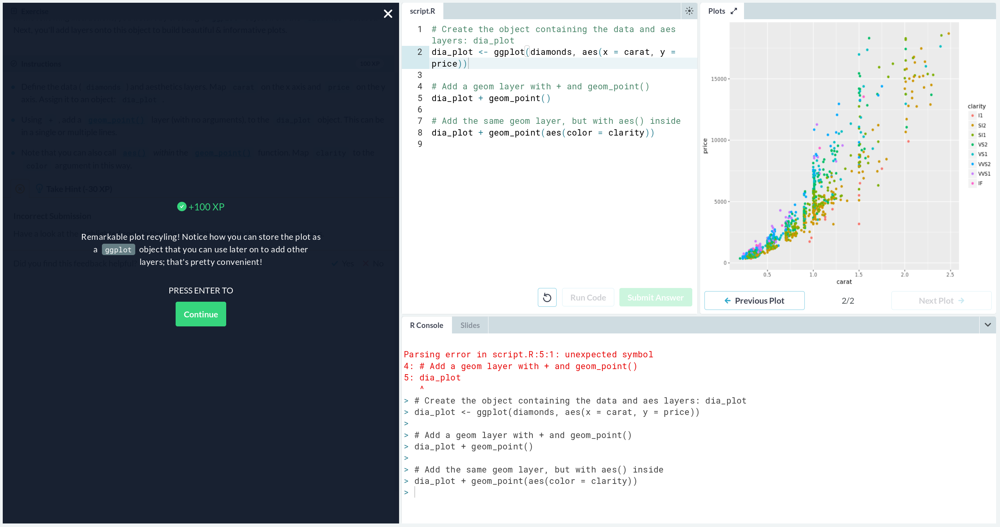
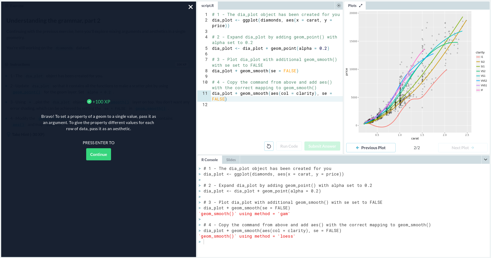

## Multiple and Logistic Regression
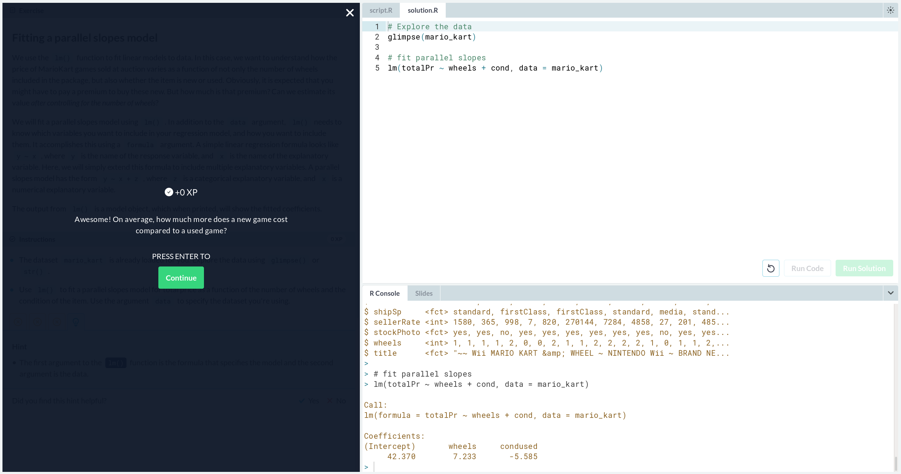
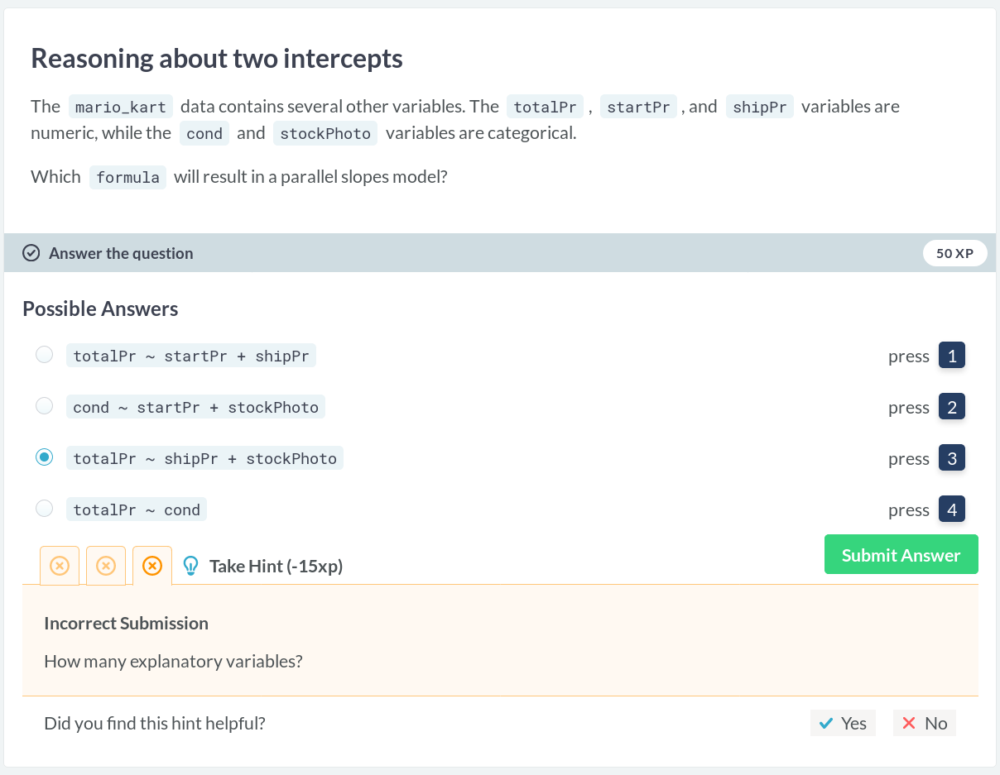
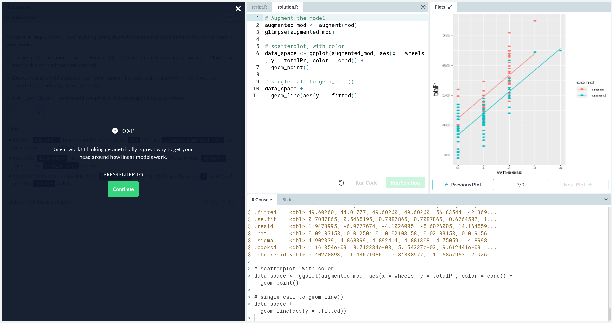
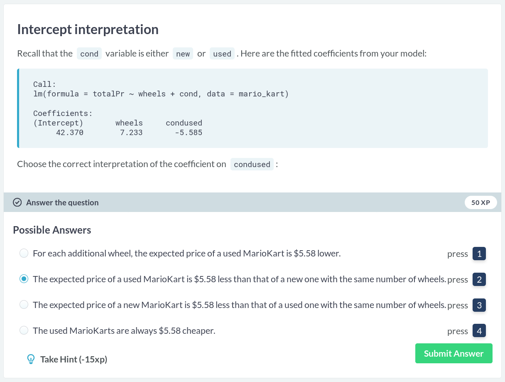
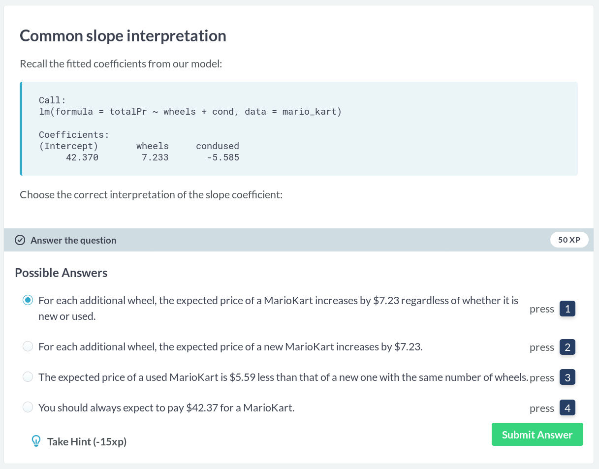

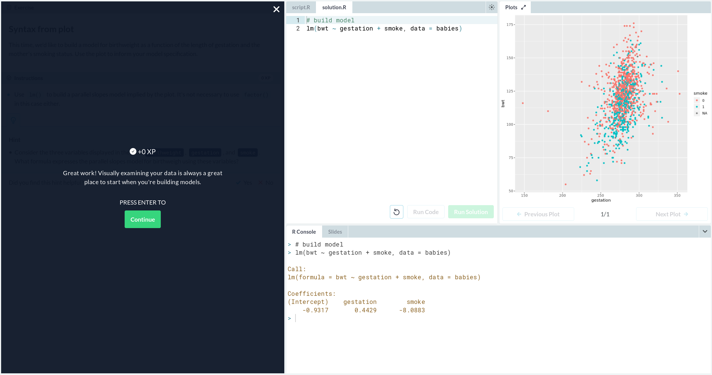

## Rubber Duck Observatory Link
[https://rcos.io/projects/rpi-cs-discord/rubber-duck/profile](https://rcos.io/projects/rpi-cs-discord/rubber-duck/profile)
