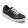
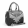
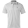

# Lab 9: TensorFlow

## Checkpoint 1: Verify Your TensorFlow

## Checkpoint 2: Run a TensorFlow classification

## Checkpoint 3: Curate some data

[1.3741634e-09 4.8942667e-10 2.1567061e-09 5.4672233e-10 5.1702307e-15
 3.8375371e-12 3.0723891e-07 1.0502000e-07 9.9998820e-01 1.1450839e-05] 8 Bag

[3.1351142e-08 2.8652641e-10 7.0082763e-08 3.7651247e-11 2.8134878e-13
 1.7562601e-15 1.3817796e-05 1.2134828e-08 9.9998474e-01 1.2869195e-06] 8 Bag

[4.7845777e-10 1.4180743e-12 7.8141882e-10 6.6148145e-13 4.5788267e-14
 5.2766439e-18 8.2156795e-08 7.9896338e-13 9.9999988e-01 2.5026647e-12] 8 Bag

